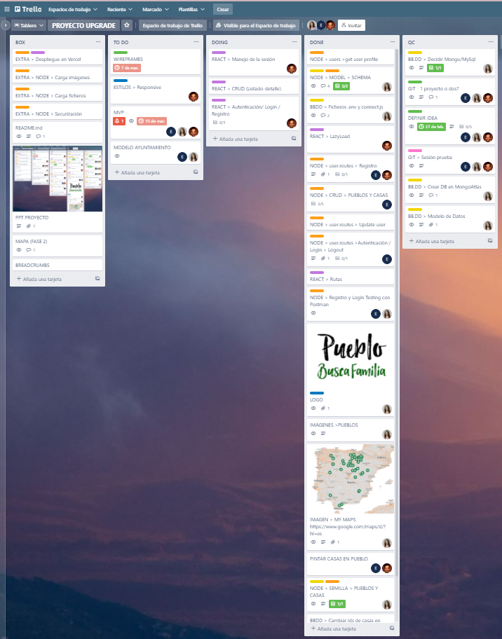

# Pueblo Busca Familia 
Upgrade Hub Full Stack Program - Final Project (Created with Node.js, React and Mongo DB)

## Table of Contents
* [Goal](#Goal)
* [Authors](#Authors)
* [Technologies](#Technologies)
* [Use](#Use)
* [How we did it](#How-we-did-it)
* [Installation](#Setup/Installation)
* [Server](#Server-Link)

## Goal
To create a website that serves as a platform for town councils that would like to offer free houses to families with children of school age in exchange of registering them in the local school.

## Authors

- [Yoel Martí](https://github.com/yoelmarti)
- [Estefanía Pedrero ](https://github.com/Estef108)
- [Paula Álvarez](https://github.com/Paulaalpe)

## Technologies
- Node 16.13.0
- React 17.0.2
- Mongo
- Tailwind
## Use
Any person that accesses the Website will be able to visualize generic information of the participating towns. Nevertheless, **people interested in viewing the available houses and in contacting the town councils must be not only registered but logged in.**.
### /pueblos
Will show a complete list of participating towns. Clicking on each of the towns will take to the town card, in which the user will find more information about the village. If the user is logged in will be also able to see the available houses and to contact the town council through the platform.
### /registro /iniciar-sesion
Users will access register section and provide basic information about them and their families. 
Town councils will have to contact the platform and, in case of viability, they will be provided with an specific access that in the future will allow them to upload and edit their information.

## How we did it
### Server
- Generate of a node server.
- Install dependencies: express, mongoose, dotenv, morgan and nodemon.
- Create the main skeleton with the controllers, models, routes and seeds folders.
- Configure MongoAtlas connection through Mongoose.
- Create auth middleware.
- Added a httpStatusCode util to control messages.
- CRUD controller and routes.
- Defined routes on index.
- Test CRUD with Postman
- Images upload

### Client

### Database
- Data Models defined prior to development.
- Mongo DB Atlas connected through Mongoose.
- 4 collections: villages, houses, users, councils.
- Each collection with its model.js
- houses y villages populated with seeds.

## Color Reference

| Color             | Hex                                                                |
| ----------------- | ------------------------------------------------------------------ |
| Color1 |  #ECEBE4 |
| Color2 |  #CC998D |
| Color3 |  #4C6663 |
| Color4 |  #481620 |

## Setup/Installation
To run this project, install it locally using npm
1. Run the development server  `npm run dev` or `yarn dev`
2. Run the client with  `npm start`

## Server Link
???? Vercel

## Screenshots

